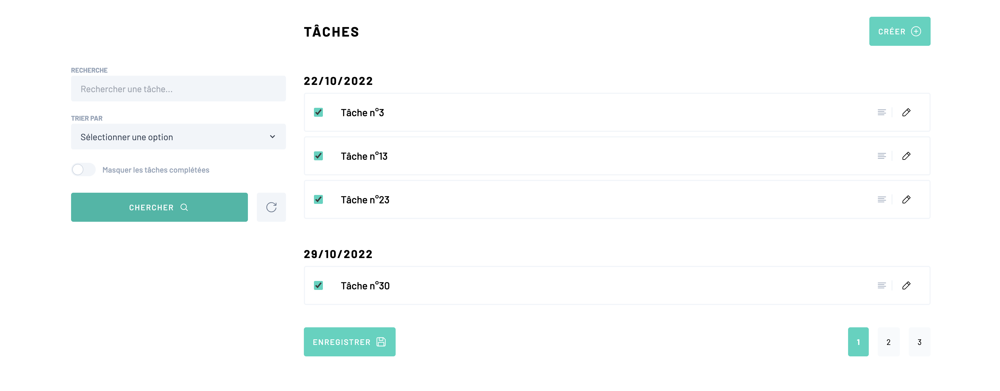
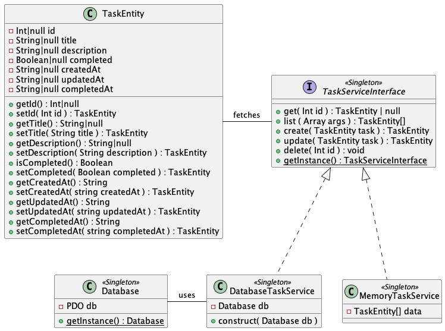
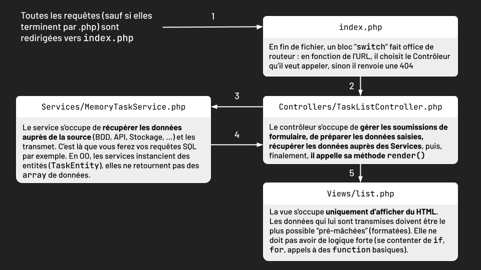
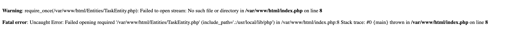
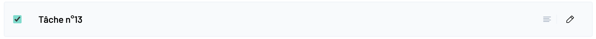
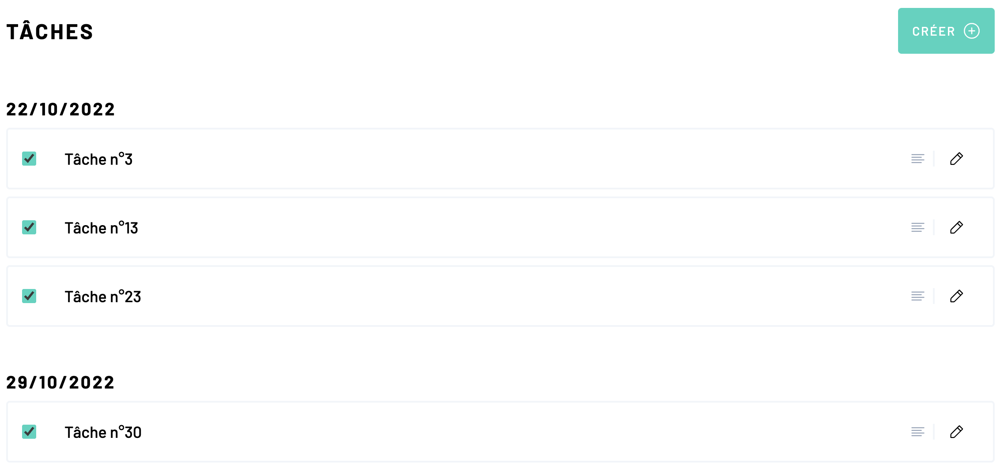
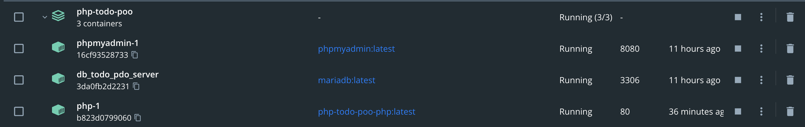
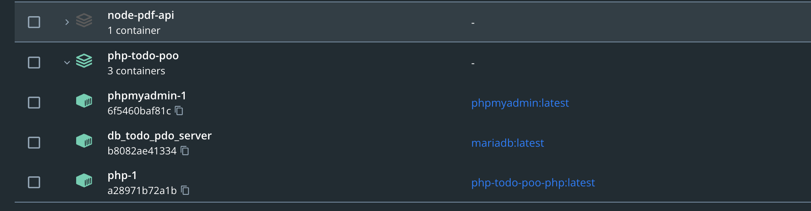

# TP PHP : TODO App MVC

Compétences mobilisées :

- Découpage MVC 
- Utilisation de PHP avec une vision orientée objet
- Gestion de formulaires
- Maximiser une réutilisation de son code





## Contexte

Jean-Michel de la compta avait dit à sa direction qu'il pouvait faire le site parce qu'il savait programmer en HTML. Cependant, une fois les maquettes intégrées, il n'y avait plus personne pour rendre le tout dynamique. 

Vous intervenez pour reprendre les maquettes déjà intégrées et ajouter le support de la gestion de soumission des formulaires, la connexion à la base de données et tout le tintouin. 

Toutes les vues sont stockées dans le dossier `src/Views`. 


## Lancer le projet 

Si vous disposez de docker sur vos postes (lancez un terminal et essayer de taper `docker` pour voir s'il se passe un truc autre qu'une erreur), vous pouvez ouvrir un terminal à la racine du dossier et lancer la commande suivante :

```shell
docker compose up
```

Cela lancera un serveur PHP sur le port 80 pour servir le dossier `src`, ainsi qu'une base de données (login & mdp : root) et PhpMyAdmin sur le port 8080.

S'il y a des erreurs PHP, type classe non-définie, **c'est normal** (yep c'est vous qui allez vous y coller).


## Partie 1 

 


### Introduction

**Prenez en main le projet**, observez-en la structure, rappelez-vous de l'architecture MVC.



- `index.php` est le **point d'entrée** (*entry point*) de l'application, **toutes les requêtes passeront par lui**, vous n'aurez pas d'URL directes (`http://localhost/Views/single.php?id=1`) mais des URL correctement formatées, réécrites (`http://localhost/task/1`). Dans l'index, vous trouverez en bas de page le block `switch` qui fait office de routeur (appelle un controller en fonction de l'URL). N'hésitez pas à faire un `var_dump( $uri )` pour voir ce qui se passe.

- `Common/`, le dossier fourre-tout par excellence. Tout ce qui est commun à l'application s'y trouve plutôt que d'être à la racine, comme par exemple, le fichier de fonctions utilitaires, le singleton de base de données etc...

- `Controllers/` je ne vous fais pas de dessin. Le contrôleur est le point d'entrée d'une vue, il s'occupe de traiter les données reçues et d'agréger les données voulues auprès des services avant de donner les données pré-mâchées à la vue qui s'occupe de les afficher. Vous avez un contrôleur pour chaque vue.

- `Entities/` le dossier où vous metterez les classes d'entités, qui sont les objets que l'on manipule (ici les tâches, mais on pourrait avoir des utilisateurs, recettes, ...).

- `Services/` le dossier où se trouveront les services qui servent de couche d'abstraction entre un mode de stockage (en mémoire, BDD, API Rest, sur le disque, ...) et les autres composants (principalement les contrôleurs).

- `Views/` le dossier contenant toutes les vues. C'est le seul endroit où vous trouverez du code HTML. Vous avez également un sous-dossier `fragments` pour les portions d'interfaces qui ne sont pas des pages entières. Chaque vue est affichée depuis la méthode `render()` d'un contrôleur. Seuls les vues situées dans le sous-dossier `fragments` sont appellées depuis d'autres vues.

- **Regardez le contenu du fichier `src/Common/functions.php`**, vous pourrez réutiliser les fonctions fournies. Consultez la documentation PHP pour les fonctions que vous ne connaissez pas (au hasard `extract()`).


Comprendre le cheminement du code :


1. **Commencez par résoudre les erreurs PHP qui se présentent à vous en implémentant les classes à partir du diagramme UML**, allez y progressivement, pas à pas et **n'implémentez dans un premier temps que ce qu'il faut pour résoudre les erreurs**. Ne faites fonctionner que la vue accueil. Voici l'erreur que vous devriez avoir :

   

   La première étape semble donc être de créer la classe `TaskEntity` (dans le bon dossier !) à partir des specs fournies dans l'UML. N'oubliez pas de charger votre fichier dans le `index.php` ensuite, sinon ça marche moins bien.


### Implémentation de la vue liste

2. **Développez l'interface de listing des tâches**, la page d'accueil. Dans un premier temps, tirez parti de la classe `MemoryTaskService` pour lister les tâches d'exemples. 

   - À partir de la capture d'écran ci-dessus, vous isolerez le code HTML utilisé pour afficher une tâche. Une fois le balisage HTML obtenu, vous le mettrez dans un fichier dédié (au hasard `Views/fragements/task-card.php`), **ça sera votre fichier de template** (ne confondez pas la notion large de template avec une balise `<template>`, en PHP <u>pur</u> on n'en n'utilisera pas). Vous pouvez à présent retirer le code d'exemple que vous venez d'extraire du fichier `/Views/list.php`. Maintenant, vous devriez avoir besoin de répéter l'affichage de ce template pour chaque tâche que vous avez. **Observez le code de la méthode `render()` située sur le contrôleur de la vue liste**, vous remarquerez qu'une liste de `TaskEntity` est passée au template `list.php`. Indiquez à votre IDE la présence de cette variable grâce à l'exemple PHPDoc ci-dessous. N'hésitez pas à faire un `var_dump( $tasks );`, **déduisez maintenant la démarche pour répéter l'affichage du template `task-card.php` pour chaque tâche dont vous disposez** (si j'étais vous, je trouverais le fichier `Common/functions.php` utile). 

     > Pour aider votre IDE à autocompléter, vous pouvez utiliser PHPDoc (tout pareil que JSDoc, aucune originalité) en haut du document pour lui indiquer quelles variables sont disponibles et quel est leur type : 
     >
     > ```php
     > <?php 
     > /**
     >  * @var TaskEntity[] $tasks
     >  */
     > ?>
     > <!-- Code HTML du template -->
     > ```

   - Vous afficherez une liste des tâches groupées par leur **jour** de création :

     

   - Vous rendrez le formulaire de filtre fonctionnel (gérez-le dans votre controller !). Pour cela, **consultez la documentation disponible dans les commentaires du code de `src/Services/TaskServiceInterface.php`**, vous y remarquerez qu'une méthode accepte certains paramètres que vous pouvez extraire du formulaire. **Vous pré-remplirez également les champs du formulaire si des valeurs ont été saisies par l'utilisateur.** 

   - Vous implémenterez également le système de pagination (coloration du bouton de page actif, changement de page, ...) en limitant l'affichage à **10 tâches par page**. Pour cela, vous pouvez par exemple modifier les liens des boutons de page pour qu'ils incluent un paramètre d'URL `page` que vous pourrez ensuite récupérer en PHP. Essayez maintenant d'appliquer des filtres dans votre formulaire, puis de changer de page. Vous perdez les valeurs des filtres. C'est parce que vos liens de pagination écrasent les paramètres d'URL du formulaire de filtre. Eh oui, coup dur pour le dev français, mais voilà ce qui se passe :

     - votre formulaire de filtres est basé sur la méthode `get`, si l'utilisateur met "*Chabrier*" en valeur pour le champ `search`, après soumission du formulaire l'URL de la page sera : `http://localhost/?search=Chabrier`.
     - maintenant, si votre lien de pagination ressemble à ça : `http://localhost/?page=2`, on perds la valeur du champ `search`.
     - Il vous faut récupérer les valeurs déjà saisies dans l'URL et y concaténer votre numéro de page (cf la ligne du dessous) pour que ça ressemble à ça : `http://localhost/?search=Chabrier&page=2`
     
     **Formattez les valeurs du formulaire de filtre pour les ajouter à l'URL des liens de pagination** ([http_build_query](https://www.php.net/manual/en/function.http-build-query.php))
     
      
     

### Utilisation de PDO pour intéragir avec une base MySQL


**:warning: NOTION SUPER IMPORTANTE** (brainfuck incoming) : si vous utilisez docker, l'hôte de la base de données n'est pas `localhost`, dans le contexte du TP il s'agit de `db_todo_pdo_server`. Si vous regardez le fichier `docker-compose.yml` vous verrez que le `services.db.container_name` a cette valeur. Lorsque vous utilisez `docker compose`, Docker créé un réseau interne aux containers (chaque entrée de `services`, donc ici `php`, `db` et `phpmyadmin`), ce réseau est **uniquement accesible depuis l'intérieur des containers** et il inclut une résolution de noms et donc techniquement vous pouvez, depuis PHP, faire un ping sur `db_todo_pdo_server`. 



Vous pouvez utiliser comme nom d'hôte tous les noms de container, donc sur la screen ci-dessus, vous pouvez ping `phpmyadmin-1`, `db_todo_pdo_server` et `php-1` (les noms sont générés par défaut).


3. **Implémentez maintenant une nouvelle classe `DatabaseTaskService.php`** (par pitié placez-la dans le bon dossier) qui récupérera non plus les tâches depuis la mémoire, mais depuis une base de données MariaDB. **Pour cela, vous vous baserez sur les specs du diagramme UML.** Créez la table en base de données au préalable. 

   **Attention** : 

   - `createdAt` doit être rempli par défaut avec le timestamp actuel
   - `updatedAt` doit être rempli par défaut avec le timestamp actuel et mis à jour à chaque modification de la ligne (c'est en SQL que ça se passe !)
   - `completedAt` doit être rempli avec le timestamp actuel lors d'une création ou d'une mise à jour **si la tâche est terminée** (bon ok là vous pouvez le faire en PHP)


4. **Rendez fonctionnelle la vue de création/suppression d'une tâche**. Vous devez utiliser la même vue et le même contrôleur pour les opérations de création, modification, suppression. Pour la modification, vous devrez pré-remplir les champs du formulaire avec les valeurs existantes de la tâche. 

   <details>
     <summary><b>ℹ️ Indice</b></summary>
     Rien ne vous interdit d'initialiser une `TaskEntity` vide :man_shrugging: 
   </details>
   
   
5. **Permutez le service `MemoryTaskService` avec `DatabaseTaskService` pour l'affichage de l'accueil (listing des tâches)**. En littéralement une ligne, vous venez de passer d'un stockage de mémoire à un stockage de base de données sans avoir à modifier vos contrôleurs, vos vues ou vos entités. *Et paf, ça fait des Chocapic* (merci les principes SOLID).


## Partie 2 : Composer & Autoload

:warning: **Attention** `docker compose` et `composer`, bien qu'ils se ressemblent, **n'ont rien à voir.**

Composer est le gestionnaire de librairies de PHP, au même titre que l'est NPM pour JavaScript. De ce fait, ils partagent beaucoup de points communs :

|                         | Composer             | NPM                 |
| ----------------------- | -------------------- | ------------------- |
| Fichier de base         | `composer.json`      | `package.json`      |
| Fichier de lock         | `composer-lock.json` | `package-lock.json` |
| Dossier des dépendances | `vendor`             | `node_modules`      |

À la différence de NPM, avec Composer, on doit avoir le dossier `vendor` sur le serveur. Le plus simple est d'avoir un accès SSH et de faire un `composer install`, mais sur les hébergeurs bas de gamme ce n'est pas le cas et il faut upload tout le dossier `vendor`...

Cependant, Composer apporte avec lui un outil fantastique : l'autoload. C'est une norme définie par PHP Fig (un groupe de devs qui œuvrent pour améliorer le langage), sous la norme [PSR-4 (PHP Standard Recommendation)](https://www.php-fig.org/psr/psr-4). 

Vous l'avez peut-être remarqué, on commence à avoir beaucoup de `require` et `include` dans nos fichiers, notamment dans `index.php`. L'autoload répond à cette problématique en étant capable de charger les fichiers de lui-même lorsqu'on en a besoin. Pour cela, il se base sur la notion de `namespace` qui vient refléter la structure des fichiers de notre application. Ainsi, on n'a plus qu'un seul fichier à `require` qui est le fichier `vendor/autoload.php` généré par Composer.

Dans le cadre de ce TP, j'ai installé Composer sur le container Docker PHP qui sert de serveur apache. **Il n'est donc pas installé sur vos machines**. Pour utiliser Composer, vous devez **vous connecter au terminal du container**. Ouvrez le logiciel Docker, assurez-vous d'être sur la page de listing des containers ("containers" dans la barre latérale) et repérez le container Docker PHP :



Ici, le container auquel je souhaite me connecter est "php-1". Cliquez dessus et dans la barre du haut à droite, vous verrez un onglet "CLI" (Command Line Interface), ouvrez-le et vous aurez accès au terminal du container.

1. **Dans le terminal de `php-1`, exécutez la commande `composer`** et assurez-vous qu'elle fonctionne. Si elle n'est pas trouvée, coupez le `docker compose`, actualisez le code du TP (les fichiers concernés sont `docker-compose.yml` et `Dockerfile`), puis une fois les fichiers mis à jour, lancez la commande `docker compose up --build --force-recreate`.

   > Pro tips de gamerz : par défaut Docker lance `sh` comme shell, vous pouvez exécuter la commande `bash` pour lancer une meilleure interface de commande qui supporte par exemple la navigation aux flèches directionnelles. 

2. Exécutez la commande `ls -l` pour lister les fichiers présents dans le répertoire courant, puis la commande `pwd` pour voir le chemin du dossier actuel. **Déduisez-en à quel dossier du projet cela correspond sur votre poste**. Vous pouvez également consulter le contenu du fichier `docker-compose.yml` dans la section `services.php.volumes`. 

3. Dans le terminal Docker, **initialisez un projet composer avec la commande dans le dossier courant `composer init`** 

   - Pour ce qui est du `vendor`, c'est l'organisation à l'origine du projet, vous pouvez mettre votre pseudo GitHub, votre nom, le nom de l'entreprise pour laquelle vous travaillez, etc...
   - Pour le `name` c'est le nom du projet, perso, je l'appelle `php-todo-poo`, donc moi, je saisis `arthur-eudeline/php-todo-poo`. 
   - En package type, vous pouvez mettre `project`.
   - **Lorsqu'il vous demande** "Would you like to define your dependencies (require) interactively", **répondez `no`**, si vous avez appuyé sur entrée sans faire exprès, soumettez une phrase vide et il vous reposera la question.
   - Pour "Add PSR-4 autoload mapping?" **répondez non**, on va le faire nous-même à notre rythme.
   - Si vous regardez le dossier de votre projet, vous devriez y voir un fichier `composer.json` !

4. **Ouvrez votre `composer.json`** et ajoutez-y les lignes suivantes :

   ```json
   {
   	"autoload": {
   		"psr-4": {
   			"Todo\\" : "."
   		}
   	}
   }
   ```

   `Todo` sera notre namespace, et je lui indique que ce namespace correspond au dossier courant. Voici quelques exemples de syntaxe pour vous aider à comprendre :

   - `"ArthurEudeline\\PersonnalWebsite\\" : "./src"` j'aurais un namespace en `ArthurEudeline/PersonnalWebsite` dont la base sera rattachée au dossier `./src`.
   - `"[namespace]\\" : "[dossier]"`

   Un namespace **doit être écrit en PascalCase** (toutes les premières lettres des mots en majuscule et sans espace). Dans le `composer.json` ils peuvent être découpés en plusieurs niveaux avec des `\\`, vous **devez obligatoirement spécifier un `\\` à la fin de votre namespace**.


Bon, à présent, il est temps de vous expliquer les namespace PHP (vous allez détester). En gros, les namespace permettent d'encapsuler votre code dans des sous-espaces nommés. Pourquoi s'infliger ça ? Avez-vous déjà essayé de déclarer une fonction ou une classe qui a le même nom qu'une autre ? Ça fatal erreur grave. Du coup, les namespace permettent d'isoler les classes et les composants pour éviter qu'ils ne rentrent en conflit, ce qui est plutôt sympa quand on utilise des librairies. **Les namespace, pour fonctionner avec l'autolaod PSR-4, doivent refléter la structure des dossiers du projet**.

5. Notre namespace sera `Todo`, et comme on l'a vu dans le `composer.json`, il a pour racine le dossier courant (donc si je me base sur le projet, la racine du namespace est `./src` vu que `composer.json` est dans `./src`,  vous me suivez ?). **Commencez par rajouter la ligne suivante dans `index.php` :**

   ```php
   <?php 
     namespace Todo;
   ```

   Le mot clé `namespace` se place toujours tout en haut du fichier PHP, vous ne pouvez pas avoir d'instruction avant. Si vous avez un vrai IDE (aka PHPStorm), ça devrait être très sapin de Noël dans votre fichier. C'est parce que vous venez de dire à PHP que vous n'étiez plus dans le namespace global, mais dans le namespace `Todo` et tout le reste du code que nous utilisons est encore dans le namespace global. Pour que ça marche, vous devriez préfixer chaque nom de classe par `\`, par exemple :

   ```php
   <?php
   namespace Todo;
   
   // Ne marche pas
   $service = DatabaseTaskService::getInstance();	
   
   // Marche, parce que DatabaseTaskService n'est pas encore dans le namespace Todo
   $service = \DatabaseTaskService::getInstance();
   ```

   C'est juste pour illustrer, ne le faites pas. Par contre, **vous devrez le faire pour chaque classe native**, comme `Exception`par exemple :

   ```php
   <?php
   namespace Todo;
   
   // Ne marche pas
   throw new Exception('oupsi');
   
   // Marche, parce qu'on dit qu'on utilise la classe Exception qui est dans le namespace global
   throw new \Exception('oupsi');
   ```

6. Prenez tous vos fichiers PHP situés dans `src/` à part ceux dans `src/Views`, et **ajoutez-leur leur namespace sauf pour `Common/functions.php`** . :warning: **Attention**, je vous rappelle que **vos namespace doivent refléter la structure de fichiers du projet**, voici quelques exemples :

   ```php
   // /index.php
   namespace Todo;
   
   // /Controllers/AbstractController.php
   namespace Todo\Controllers;
   ```

7. Maintenant, c'est là que ça devient marrant, on va voir les `use`. Puisque vous avez ajouté un namespace pour tous vos fichiers, les classes et les functions qu'ils contiennent ne sont plus accessibles puisqu'elles n'appartiennent plus au namespace global. Seules les classes et functions écrites dans des fichiers situés dans le même dossier et avec le même namespace sont accessibles. Si par exemple, je voulais appeler `DatabaseTaskService` depuis `index.php`, je devrais faire ça :

   ```php
   <?php
     namespace Todo;
   
   	$service = Todo\Services\DatabaseTaskService::getInstance();
   ```

   Ce qui est relativement chiant je vous le concède (et là on a pas beaucoup d'imbrication !). Cependant vous pouvez dire à PHP "Ok là je vais utiliser `DatabaseTaskService` et à chaque fois que j'y ferai référence, je voudrais dire `Todo\Services\DatabaseTaskService`", eh ben on fait ça avec les `use` :

   ```php
   <?php
     namespace Todo;
   
   	use Todo\Services\DatabaseTaskService;
   	
   	$service = DatabaseTaskService::getInstance();
   ```

   Vous pouvez aussi faire un `use` vers un dossier quand il y a beaucoup de classes à utiliser (perso je l'utilise rarement) :

   ```php
   <?php
     namespace Todo;
   
   	use Todo\Services;
   	
   	$service1 = Services\DatabaseTaskService::getInstance();
   	$service2 = Services\MemoryTaskService::getInstance();
   ```

   **Repassez dans vos fichiers pour ajouter les instructions `use` et empêcher les erreurs PHP** (pensez à le faire dans le fichier `Common/functions.php` et ceux situés dans `Views` . :warning: **Attention** : les `use` se placent juste après le `namespace`, ce n'est qu'après l'écriture des `namespace` et des `use` que vous pourrez avoir votre code PHP.

8. **Rafraîchissez la page**, il ne faut pas que vous ailliez d'erreurs ! 

9. Dans votre `index.php` **retirez tous les `include` et `require`**, rafraîchissez votre page, vous devriez avoir des erreurs ! 

10. **Générez le fichier `vendor/autoload.php` en exécutant la commande `composer dump-autoload`.** **Chargez-le dans votre `index.php`** comme ceci :

    ```php
    <?php 
      namespace Todo;
    
    	// use [...]
    
    	require_once __DIR__ . "/vendor/autoload.php";
    ```

    **Actualisez la page, il devrait y avoir une dernière erreur :**

    

    C'est parce que le fichier `Common/functions.php` n'est pas chargé par l'autoload !

11. **Dites à composer de toujours charger le fichier `Common/functions.php`**, dans votre `composer.json` :

    ```json
    {
      "autoload": {
            "psr-4": {
                "Todo\\" : "."
            },
            "files": [
                "./Common/functions.php"
            ]
        }
    }
    ```

    **Exécutez à nouveau la commande `composer dump-autoload` et actualisez la page !**


## Notions Utiles

- **Singleton** : design pattern qui permet qu'une classe ne soit instanciée qu'une seule fois. La démarche à suivre :

  - Ajoutez une propriété statique sur votre classe qui contiendra l'instance de cette classe

  - Passez le constructeur en visibilité protected ou public pour empêcher à la classe d'être instanciée avec le mot clé `new`

  - Créez une méthode statique telle que `getInstance()` qui aura la logique suivante : si l'instance n'est pas instanciée, je l'instancie et je la retourne, sinon je la retourne directement.

  - Tada !

    > **Pro tips de gamer** : en PHP vous pouvez utiliser des [Trait](https://www.php.net/manual/fr/language.oop5.traits.php) (forme d'héritage multiple) pour gérer la création des singleton et centraliser la logique (vu qu'on a plusieurs singleton dans ce projet). Pour instancier une classe enfant sans connaitre son nom, vous pouvez faire `self::$instance = new static();` (attention ce n'est possible que dans les versions récentes de PHP, je dirais >=7.4)

- Convertir des valeurs dans un autre type 

  - `strval()`
  - `intval()`
  - `floatval()`
  -  `boolval()`